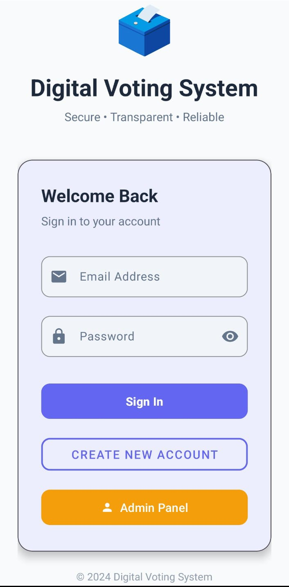
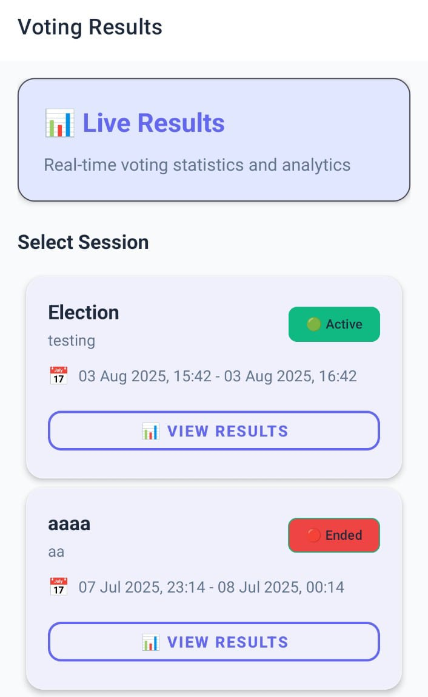
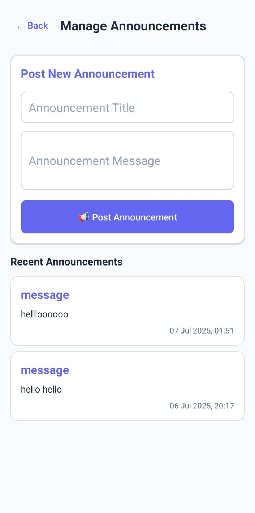

# 🗳️ E-Voting Android App

A comprehensive Electronic Voting System built for Android that enables secure, transparent, and accessible voting for political elections. This project implements a complete voting ecosystem with both **user** and **admin** interfaces, featuring real-time vote counting, OTP verification, and Firebase backend integration.

---

## 👥 Features

### 🔐 For Voters:
- **User Registration & Authentication:** Secure signup with CNIC validation and Firebase login system  
- **Vote Casting Interface:** Intuitive UI showing political parties with symbols and constituencies  
- **OTP Verification:** Phone number verification using Firebase Authentication  
- **Profile Management:** Update personal details and view vote history  
- **Real-time Notifications:** Stay updated on election status and announcements  

### 🛠 For Administrators:
- **Admin Dashboard:** Centralized control for managing elections  
- **Party Management:** Add/update political parties with their logos and regions  
- **Live Vote Counting:** Real-time tracking of votes by party  
- **Announcements System:** Broadcast messages to all users  
- **Vote Analytics:** Visualize vote distribution and participation metrics  

---

## 🛠️ Tech Stack

| Layer       | Tools / Tech                         |
|-------------|--------------------------------------|
| **Platform** | Android (Java)                       |
| **Backend**  | Firebase Realtime Database           |
| **Auth**     | Firebase Authentication (Phone OTP)  |
| **UI**       | Android XML Layouts + Material Design|
| **Sync**     | Realtime data via Firebase           |
| **Notifications** | Android Push Notifications     |

## 📸 App Screenshots

### 🔐 Login Screen

### 🗳️ Cast Vote Screen

### ✅ Vote Confirmation

### 📊 Results View

### 🧑‍💼 Admin Panel

### 📣 Announcements

### 🧾 Voter Dashboard

### ⏳ Voting Session

